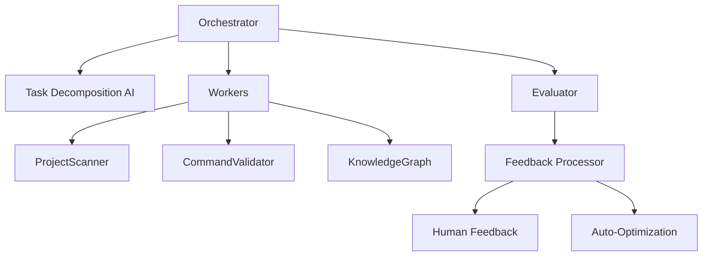

# System Structure

## Directory Structure

```
mcp-orchestrator/
├── core/
│   ├── orchestrator.ts       # Main coordination logic
│   ├── task-manager.ts       # Task decomposition/sequencing
│   └── priority-queue.ts     # Priority-based task execution
├── workers/
│   ├── project-scanner.ts    # Project structure analysis
│   ├── command-validator.ts  # Command safety checks
│   ├── knowledge-worker.ts   # Error pattern matching
│   └── ai-integration.ts     # External AI communication
├── messages/
│   ├── types.ts              # Message schema definitions
│   ├── parsers.ts            # Message validation/transformation
│   └── serializers.ts        # Message serialization
├── schemas/
│   └── orchestration.yaml    # Protocol buffer schemas
└── config/
    ├── workers.yaml          # Worker configurations
    └── mcp-extensions.yaml   # MCP extension points
```

## Structure Graph


